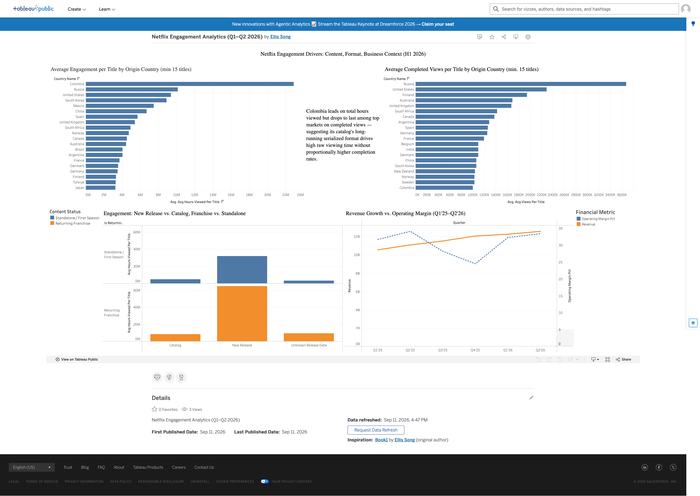

# Netflix Engagement Analytics

A content-engagement analysis of Netflix's public H1 2026 "What We Watched" report, built as a portfolio project targeting Data Analyst / Analytics Engineering roles in sports & entertainment media. 

### 📊 [View the Live Interactive Dashboard on Tableau Public →](https://public.tableau.com/app/profile/ellis.song3694/viz/NetflixEngagementAnalyticsQ1Q22026/Dashboard1)

## What this project does

Decomposes Netflix engagement into content, format, and business drivers:
- Which countries' content generates the strongest engagement, and by which definition of "engagement"
- Whether audiences favor new content or returning franchises
- How content-level engagement trends relate to Netflix's actual quarterly business performance

## Data sources

- **[Netflix's "What We Watched" Engagement Report, H1 2026](https://about.netflix.com/en/news/what-we-watched-a-netflix-engagement-report)** — title-level Hours Viewed, Views, Runtime, Release Date, and global availability for ~17,000 titles. Note: this report's biannual, earnings-tied format is being discontinued after this release; Netflix is moving to an annual report starting 2027.
- **[TMDB (The Movie Database)](https://www.themoviedb.org/)** — genre, origin country, and original language, matched against the engagement report by title. *This product uses the TMDB API but is not endorsed or certified by TMDB.*
- **Netflix's official quarterly investor-relations workbooks** (Income Statement, Cashflow) — [ir.netflix.net](https://ir.netflix.net/financials/quarterly-earnings/default.aspx), cross-validated against SEC filings.

## Pipeline

| Step | Script | What it does |
|---|---|---|
| 1 | `clean_netflix_engagement.py` | Parses the raw xlsx (irregular header, footer rows, `h:mm` runtime), produces a clean staging table |
| 2 | `enrich_tmdb.py` | Matches titles against TMDB for genre/origin/language, with local caching and automatic retry of network failures |
| 3 | `join_enrichment.py` | Merges enrichment results back onto the staging table |
| 4 | `add_engagement_buckets.py` | Derives `release_bucket` (new/catalog/unknown) and `is_returning_franchise` from title/date patterns |
| 5 | `extract_financials.py` | Pulls quarterly revenue, margin, and cash flow directly from Netflix's official workbook |
| 6 | `setup_duckdb.py` | Loads everything into a local DuckDB database |
| 7 | `*.sql` | The actual analysis — country engagement rankings, release-bucket cross-tab, runtime-by-country |
| 8 | `export_for_tableau.py` | Materializes query results as CSVs (Tableau Public can't connect to DuckDB directly) |

Reproduce the full pipeline: run each script in order from a Python environment with `pandas`, `requests`, `rapidfuzz`, `duckdb`, and `pycountry` installed. TMDB enrichment requires a free API key set as the `TMDB_API_KEY` environment variable.

## Methodology notes & data-quality decisions

This section exists because the honest answer to "why did you make this choice" matters as much as the finding itself.

- **~65% of titles have no release date.** The pattern of *which* titles have one (recognizable licensed catalog titles like *Despicable Me 3* are blank; content that appears to have premiered on Netflix has a date) suggests this may be a rough proxy for original vs. licensed content — untested, and treated as an open question, not a conclusion.
- **TMDB matching required two rounds of debugging**, both instructive: (1) fuzzy matching initially favored low-popularity companion/aftershow content sharing a franchise's name over the actual flagship title — fixed by preferring the most popular candidate among text-similarity matches, not just the top text score; (2) passing a title's release year to TMDB's search API wrongly excluded well-known shows (e.g. *Peaky Blinders*) whose *original* premiere predated the season being searched — TV show searches no longer pass a year filter as a result.
- **`Views` vs. `Hours Viewed` are not interchangeable**, and the choice matters. `Views = Hours Viewed ÷ Runtime`, so Hours Viewed rewards total watch time regardless of format length, while Views is runtime-normalized (a completed 90-minute movie and a completed 20-hour season both count as "1"). Both are reported for the country-ranking analysis below, because they answer genuinely different questions and diverge sharply for some countries.
- **A handful of duplicate `(title, content_type)` keys exist** where two different real titles share an exact name (e.g. two different films both titled *Monster*) — affects roughly 3 titles out of 17,000+, documented rather than fixed.
- **Long-tail matching errors exist and were spot-checked, not eliminated.** One identified case: a low-engagement title ("Pattaya," ~200K hours viewed — negligible relative to the dataset) likely matched to the wrong TMDB entry; left uncorrected given its negligible impact on any aggregate finding.

## Key findings

**1. Engagement leadership depends entirely on which metric you use — and the divergence is itself the finding.**
Colombia has the highest average Hours Viewed per title (~22.9M) among countries with a reliable sample size — nearly double the US. But on average completed Views per title (a runtime-normalized measure of genuine completion), Colombia drops to last among the top 20, while Russia and the US lead both metrics.

Digging further: Colombian shows have a ~3x longer median season runtime than US shows (1,197 min vs. 375 min) — a real contributing factor. But the magnitude of the divergence is better explained by concentration: five franchises (*The Queen of Flow*, *Sin senos sí hay paraíso*, *Fake Profile*, and others) account for roughly 82% of Colombia's total engagement hours, suggesting a small number of exceptional long-running hits — not the country's catalog broadly — are driving the Hours ranking.

**2. Returning franchises meaningfully outperform standalone/first-season content.**
Among titles released within the report window, a new season of an existing franchise averaged ~64.6M hours viewed vs. ~31.8M for standalone new content — roughly 2x. The same directional pattern holds in the catalog and unknown-release-date buckets too, suggesting durable audience loyalty to established franchises rather than just new-release hype.

**3. Content engagement trends held steady through a quarter of margin compression.**
Netflix's operating margin dipped to 24.5% in Q4 2025 before recovering to 33.4% by Q2 2026, while revenue grew every quarter without exception (H1 2026 revenue: $24.81B, +14-16% YoY).

## Recommendations

*(For a hiring-manager / stakeholder audience — analytical, not a business plan.)*

Long-running serialized content, particularly from Colombia's catalog, generates disproportionately high total engagement hours — directly aligned with Netflix's own stated shift toward engagement (not subscriber counts) as its primary performance proxy, per its Q1/Q2 2026 shareholder letters. This suggests continued or expanded investment in this content type and format warrants consideration by Content Planning and Programming stakeholders.

However, the same content underperforms substantially on completed-views breadth, suggesting this engagement may be concentrated among a narrower, highly-committed audience rather than reflecting broad new-audience appeal — a materially different kind of "win" than a title that performs well on both metrics (as Russia's and the US's catalogs do).

Before scaling investment on the strength of this finding alone, a follow-up analysis using session-level or per-episode drop-off data — not available in this public report — would be needed to distinguish sustained, active engagement from partial or background viewing, and to determine whether this pattern reflects a small number of exceptional franchises rather than the format broadly.

## Tools

Python (pandas, requests, rapidfuzz, pycountry), SQL (DuckDB), Tableau Public. TMDB API for content metadata; Netflix investor-relations data for financial context.

## License

Code in this repository is licensed under the MIT License (see `LICENSE`). This license covers the original code and analysis only — it does not extend to Netflix's, TMDB's, or SEC filing data, which remain the property of their respective sources and are used here under their public terms of use.